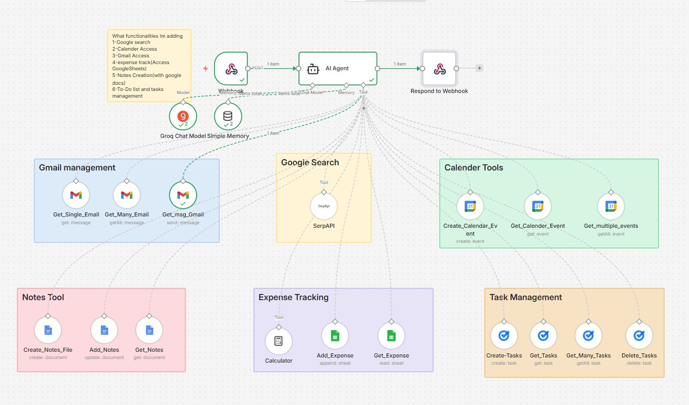

# 🤖 n8n Personal Assistant Agent

An AI-powered personal assistant built with n8n, Groq, and Streamlit.

## Features
- 📅 Google Calendar management
- 📧 Gmail read & reply
- ✅ Google Tasks / To-Do management
- 📝 Notes via Google Docs
- 💰 Expense tracking via Google Sheets
- 🔍 Web search via SerpAPI

## Tech Stack
- **n8n** – workflow automation
- **Groq** – LLM (chat model)
- **Streamlit** – chat UI frontend
- **Google Workspace APIs** – Calendar, Gmail, Tasks, Docs, Sheets

## Setup
1. Import the n8n workflow JSON into your n8n instance
2. Configure your Google OAuth credentials in n8n
3. Add your SerpAPI key
4. Run the Streamlit frontend:
```bash
pip install -r requirements.txt
streamlit run app.py
```

## Architecture
The Streamlit UI sends messages to an n8n webhook → AI Agent (Groq) → routes to the correct tool → responds back.
 


